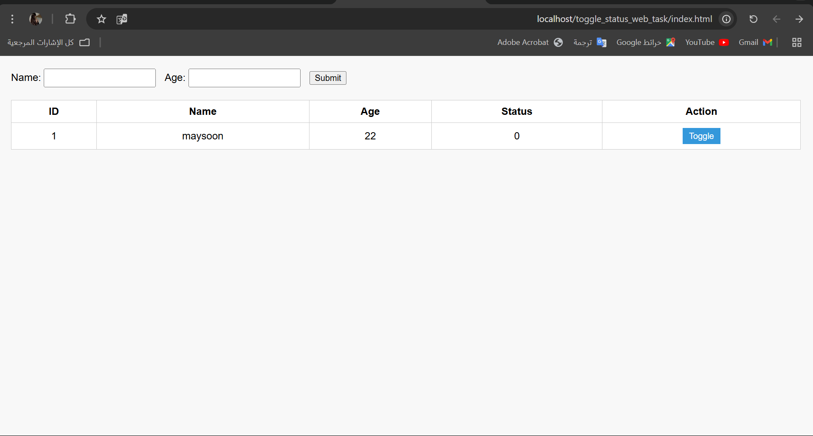

# 🟢 User Status Toggle – Smart Methods Web Task

هذا المشروع تم تنفيذه ضمن تدريب مسار الويب في "الأساليب الذكية".  
فكرته بسيطة لكنها عملية: إدخال بيانات مستخدم (اسم + عمر)، عرضهم مباشرة في جدول، مع إمكانية التحكم في حالة كل مستخدم بزر Toggle يتحول بين 0 و 1.

## 🧩 فكرة المشروع

- بناء نموذج لإدخال اسم المستخدم وعمره.
- حفظ البيانات في قاعدة بيانات MySQL باستخدام PHP.
- عرض كل المستخدمين مباشرة في جدول على نفس الصفحة.
- إضافة زر "Toggle" بجانب كل سجل لتغيير الحالة من مفعّل إلى غير مفعّل (0 ↔ 1).
- تحديث الحالة مباشرة بدون إعادة تحميل الصفحة باستخدام JavaScript و fetch API.

## 💻 الأدوات المستخدمة

- HTML – لبناء النموذج والواجهة.
- CSS – لتنسيق الصفحة.
- JavaScript – لقراءة البيانات وتحديثها تلقائيًا.
- PHP – للتعامل مع قاعدة البيانات.
- MySQL – لحفظ بيانات المستخدمين.
- XAMPP – لتشغيل السيرفر المحلي.

## 📸 صورة من المشروع

## 🗃️ هيكل الملفات

| الملف | الوظيفة |
|------|----------|
| `index.html` | يحتوي النموذج + الجدول |
| `insert.php` | إدخال البيانات في قاعدة البيانات |
| `fetch.php` | جلب جميع البيانات لعرضها في الجدول |
| `update.php` | تحديث الحالة عند الضغط على زر Toggle |
| `db.php` | الاتصال بقاعدة البيانات |
| `style.css` | تنسيقات الصفحة |
| `README.md` | شرح المشروع |
| `images/` | يحتوي صورة توضيحية للمشروع |

## 🛠️ إعداد قاعدة البيانات

- اسم القاعدة: `run_pose_db`
- اسم الجدول: `users`
- الأعمدة:
  - `id` (رقم – مفتاح أساسي – Auto Increment)
  - `name` (نص)
  - `age` (رقم)
  - `status` (رقم – 0 أو 1)

## 📝 ملاحظات

- تأكد من تشغيل Apache وMySQL من XAMPP.
- المشروع يشتغل على الرابط: http://localhost/toggle_status_web_task/index.html
---

تم تنفيذ المشروع بالكامل وتجربته بنجاح ✅